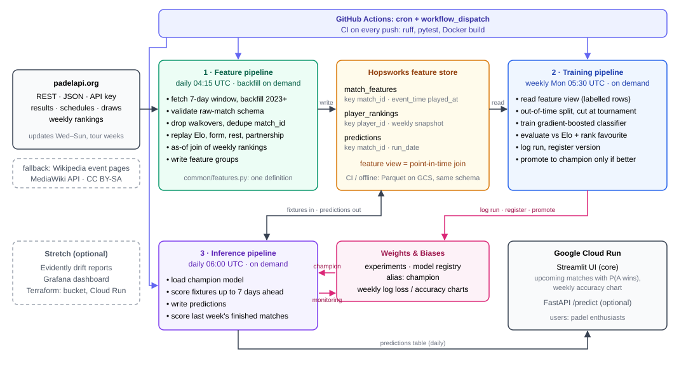

# Padel Predictor — Project Proposal

> **Working draft for `docs/proposal.pdf` (MS1, due Thu 01.10.2026, 23:59).**
>
> The sections below match the four graded sections of the proposal and are
> pre-filled from the system in this repository. Everything marked **`DECIDE:`**
> is a decision only you can make — above all the live data source. Rewrite this
> in your own words before exporting: you must be able to defend every sentence
> at the oral exam. Delete this quote block before exporting.

## 1. Problem statement

Predict the **winner of a professional padel match before it is played**.

- **Target.** For a scheduled match between team A and team B (two players each),
  the probability that team A wins. Padel matches have no draws, so this is a
  binary classification with a calibrated probability.
- **Horizon.** Predictions are made for every fixture up to **7 days ahead**, and
  refreshed daily as results and fixtures arrive.
- **Scope.** Professional tour doubles matches only. Not amateur or club play,
  not set-by-set or in-play prediction.
- **Success criterion.** Beat an **Elo baseline** on a chronological holdout of
  the most recent 20% of matches. The Elo baseline predicts the higher-rated
  pair using the Elo expectation itself as its probability. The model must
  improve **log loss** over that baseline; accuracy and Brier score are reported
  alongside. A majority-class baseline is logged as a floor.
  **`DECIDE:`** fix a concrete number once you have real data, e.g.
  "log loss ≤ 0.46 vs. 0.49 for Elo".

Why this criterion: a strong favourite wins most padel matches, so raw accuracy
flatters any model. Log loss against Elo asks the real question — does the
system know anything beyond who is higher rated?

## 2. Originality and motivation

**`DECIDE:` write this section yourself.** It is graded on the specific argument
you make, and a generic answer scores poorly. Points worth making:

- Padel is under-served compared to tennis or football prediction: there is no
  standard public dataset, so the data engineering is genuine rather than a
  download.
- Doubles introduces a modelling feature singles sports do not have: **pair
  chemistry**. Ratings must be attributed to individual players while results
  only exist for pairs, and partnerships change between tournaments.
- Check the past projects on [mlops-lab.ch](https://mlops-lab.ch) and the
  [KTH ID2223](https://id2223kth.github.io) projects, and state in one sentence
  what yours does differently.

## 3. Data source and features

### Source

**`DECIDE:` name the live source and confirm its terms of use before MS2.**
This is the single biggest open risk in the project — pick it early and check
that it exposes both finished results *and* upcoming fixtures. The ingestion
layer is already written against an interchangeable adapter interface
(`src/padel_predictor/features/sources.py`), so swapping sources means editing
one method, `HttpMatchSource.parse_records`.

- **Update frequency.** Tournaments run Wednesday to Sunday; the feature
  pipeline runs **daily at 04:15 UTC** and fetches a window reaching 7 days back
  and 7 days forward, so late-corrected results are re-ingested and new fixtures
  appear.
- **Development source.** A deterministic synthetic adapter (`PADEL_SOURCE=sample`)
  produces the same schema offline. CI and a fresh clone run on it, so the
  pipeline is testable without credentials.

### Label

`winner ∈ {A, B}`, taken from the completed match record at the source. A
fixture that has not been played carries a null winner — those rows are exactly
what the inference pipeline predicts.

### Features

All six are differences between the two teams, computed by replaying match
history in chronological order
(`src/padel_predictor/common/features.py`):

| Feature | Meaning |
| --- | --- |
| `elo_diff` | Team Elo (mean of its two players) difference |
| `rank_points_diff` | Combined tour ranking points difference |
| `form_diff` | Win rate over each player's last 5 matches |
| `rest_days_diff` | Days since the team's freshest player last played |
| `partnership_diff` | Matches this exact pair has already played together |
| `tier_level` | Tour tier as an ordinal (challenger → major) |

### Leakage and split

- **No leakage by construction.** Every feature row is computed from rolling
  state that contains only matches finishing *strictly earlier*; the match's own
  result is folded into the state only after its row is built. A unit test
  asserts this: flipping a match's winner must not change that match's features.
- **Chronological split.** The oldest 80% of labelled matches train, the newest
  20% test. A random split would let later matches inform earlier predictions
  and inflate every metric.
- **One feature definition.** Training and inference import the same
  `build_feature_frame`, so there is no training–serving skew.

## 4. System design

Three automated pipelines:

1. **Feature pipeline** — daily GitHub Actions cron plus a date-range backfill.
   Ingests from the live source, rebuilds features, writes a dated snapshot.
2. **Training pipeline** — weekly cron plus on demand. Reads the feature store,
   trains and evaluates against the Elo baseline, logs to MLflow, and promotes
   the model to the `@champion` alias only if it beats the current champion.
3. **Inference pipeline** — daily cron plus on demand from the UI. Loads the
   champion model and serves predictions for upcoming fixtures.

### Stack

| Concern | Choice |
| --- | --- |
| Feature store | Versioned Parquet snapshots, local dir or `gs://` bucket |
| Tracking & registry | MLflow, models addressed by `@champion` alias |
| Model | `HistGradientBoostingClassifier` on six engineered features |
| Orchestration | GitHub Actions (cron + `workflow_dispatch`) |
| Serving | FastAPI + Streamlit, one Docker image |
| Deployment | **`DECIDE:`** Cloud Run or a Hugging Face Space — both are wired in `.github/workflows/deploy.yml` |
| Reproducibility | `uv.lock`, pinned Docker image, unit tests in CI |

**Repository:** https://github.com/Noah-Rod/padel-predictor (public)
